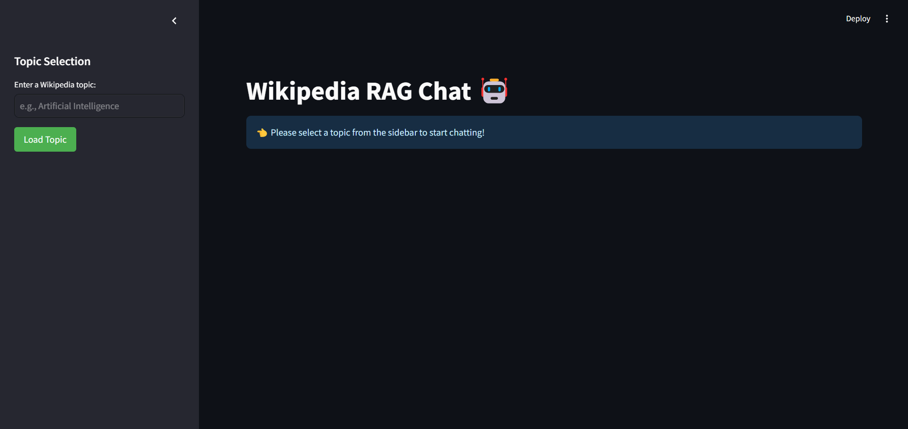
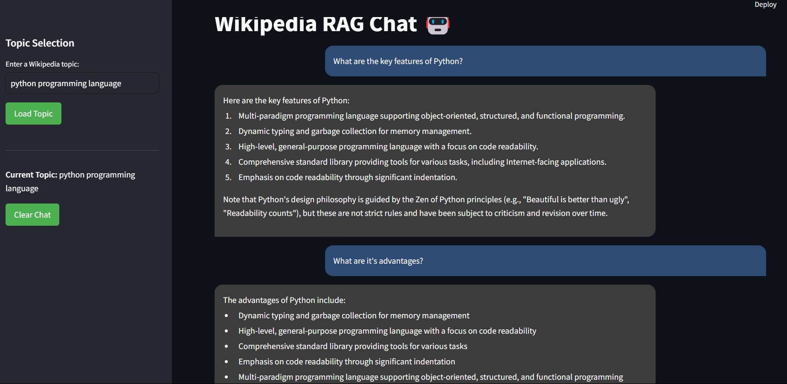

# Wikipedia RAG Chat 🤖

A Streamlit-based application that enables interactive conversations with Wikipedia content using RAG (Retrieval-Augmented Generation) technology. The app allows users to select any Wikipedia topic and engage in a chat-based Q&A session about that topic.

## Features 🌟

- Real-time Wikipedia content retrieval
- Interactive chat interface with message history
- RAG-powered responses using LLama 3.2 models
- Dark theme UI with modern styling
- Context-aware responses with chat history
- Vector database storage using Chroma
- Relevance scoring for accurate information retrieval

## Installation 🛠️

1. Clone the repository:
```bash
git clone https://github.com/yourusername/wikipedia-rag-chat.git
cd wikipedia-rag-chat
```

2. Create a virtual environment:
```bash
python -m venv venv
source venv/bin/activate  # On Windows: venv\Scripts\activate
```

3. Install required packages:
```bash
pip install -r requirements.txt
```

## Dependencies 📚

- streamlit
- langchain
- langchain-community
- wikipedia-api
- chromadb
- fastembed
- ollama

## Usage 🚀

1. Start the Streamlit app:
```bash
streamlit run app.py
```

2. Open your browser and navigate to `http://localhost:8501`
3. Enter a Wikipedia topic in the sidebar
4. Start chatting about the selected topic!

## App Screenshots 📸

[Add screenshots of your application here]





## Project Structure 📁

```
wikipedia-rag-chat/
├── app.py                 # Main Streamlit application
├── functions_3.py         # Core functionality and RAG implementation
├── requirements.txt       # Project dependencies
├── README.md             # Project documentation
└── wikipedia_chroma_db/  # Vector database storage directory
```

## Key Components ⚙️

### RAG Implementation
- Uses LangChain for the RAG pipeline
- FastEmbed embeddings for efficient vector storage
- Chroma vector store for similarity search
- Custom prompt template for natural responses

### User Interface
- Dark theme with modern styling
- Responsive chat container
- Clear topic selection sidebar
- Message history display
- Interactive input area

## Configuration Options ⚡

You can modify the following parameters in `functions_3.py`:
- Chunk size for text splitting (default: 1000)
- Chunk overlap (default: 100)
- Number of retrieved documents (k=4)
- Similarity score threshold (0.3)
- Model temperature settings

## Contributing 🤝

1. Fork the repository
2. Create a new branch
3. Make your changes
4. Submit a pull request

## Known Issues and Limitations 🚧

- Limited to topics available on Wikipedia
- Requires local Ollama installation
- Response time may vary based on topic complexity
- Memory usage increases with chat history

## Future Improvements 🔮

- [ ] Add support for multiple language Wikipedia articles
- [ ] Implement conversation memory management
- [ ] Add export functionality for chat histories
- [ ] Improve error handling and user feedback
- [ ] Add support for custom knowledge bases

## License 📄

[Add your license information here]

## Acknowledgments 👏

- LangChain for the RAG framework
- Streamlit for the web interface
- Wikipedia API for content access
- Ollama for the LLM implementation
